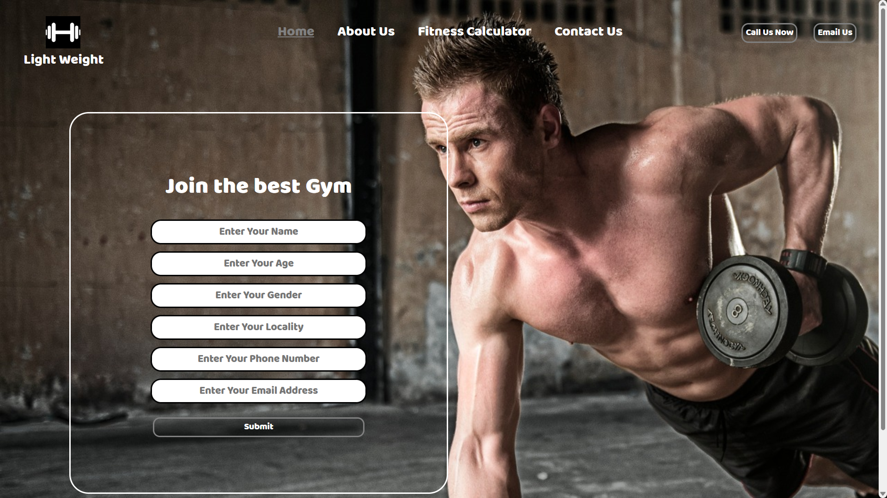

# Light Weight Gym Landing Page

Welcome to the Light Weight Gym Landing Page project! This project is a simple and elegant landing page designed for a gym website. It uses basic web technologies to create a clean and visually appealing experience for users.

## Technologies Used
This project was built using the following technologies:
- **HTML**: For the structure and content of the page.
- **CSS**: For the styling and layout.

## Project Overview
The landing page is designed to showcase a gym's offerings, with a focus on simplicity and user-friendly design.

## Project URL
You can view the live project here: [Light Weight Gym Landing Page](https://light-weight-gym-landing-page.netlify.app/).

## Project Screenshot

## How to Use
If you'd like to run this project locally, you can follow these steps:
1. Clone this repository to your local machine.
2. Open the `index.html` file in a web browser to view the landing page.

## Contributing
Contributions to this project are welcome! If you'd like to contribute, please fork the repository and create a pull request with your changes.

## Contact
If you have any questions or feedback, feel free to reach out to me via GitHub or bilalchanna67@gmail.com.